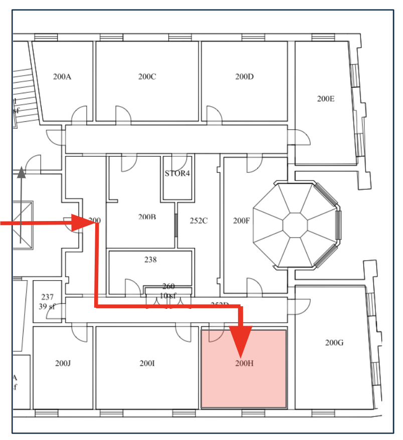

# Appointment

I don't have fixed office hours this semester. Instead, I am using an appointment scheduling system _Calendly_ to make it easier for you to find a time that works for you.

You can schedule an appointment with me using **[using this link](https://calendly.com/ssultan-dpq/)** or clicking on "Schedule Appointment" from menu bar ☝🏽 in the top right corner. 

I also have an <u>**Open-door Policy**</u> and am generally in my office (Riley Hall 200-H) from 10 AM - 4 PM on most weekdays. You are always welcome to drop by and chat. 

 

I am also ofcourse available via  email. 